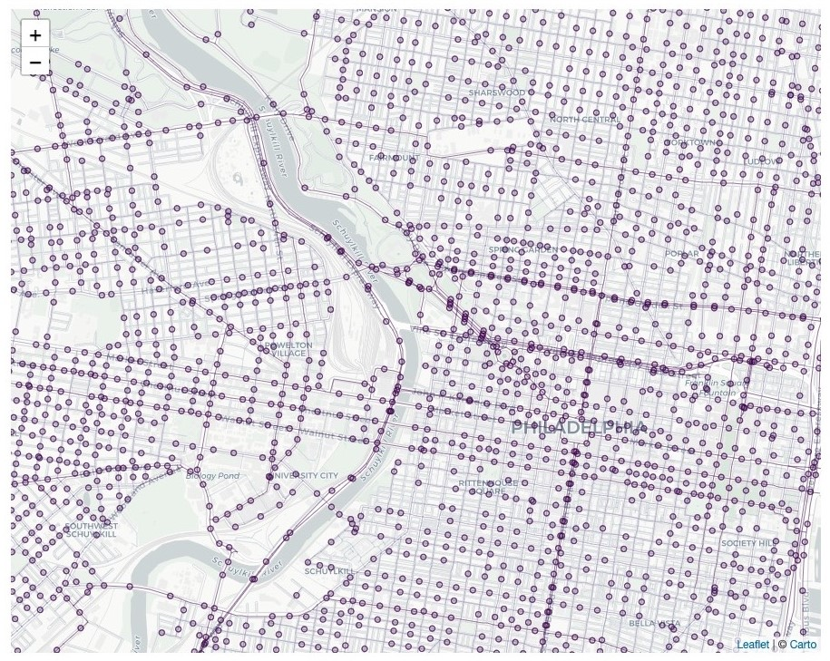
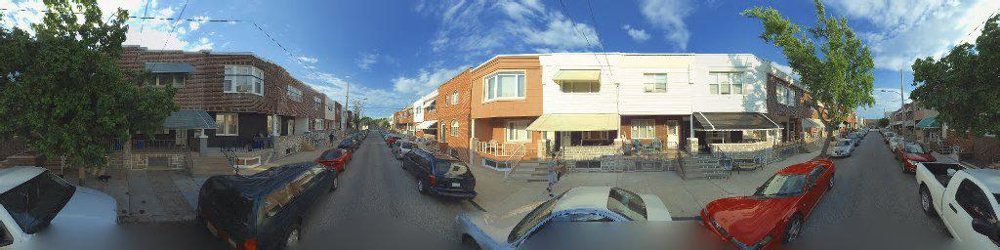
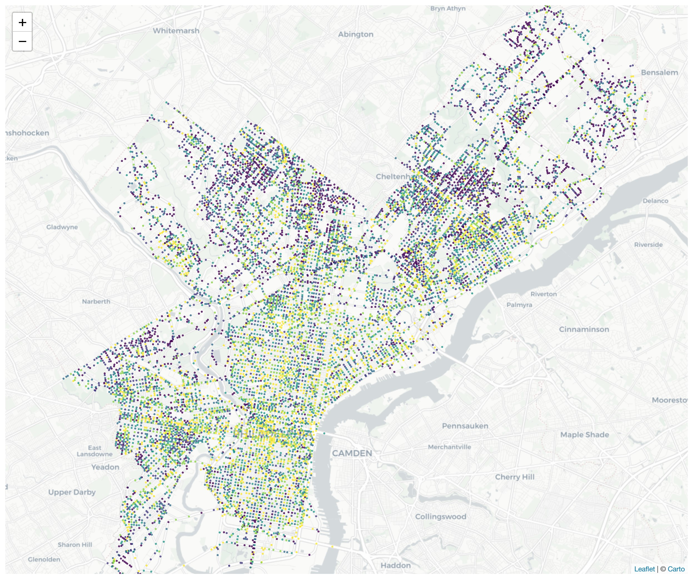
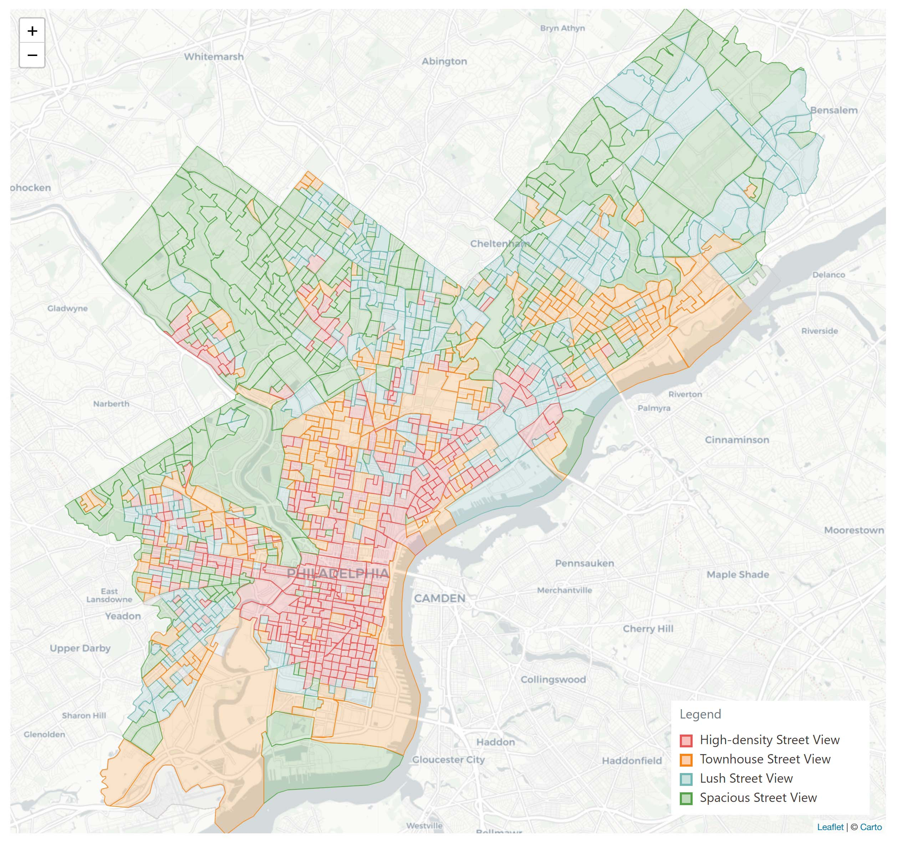
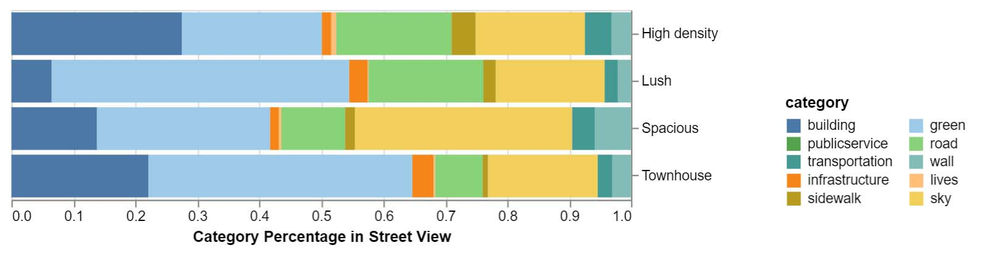
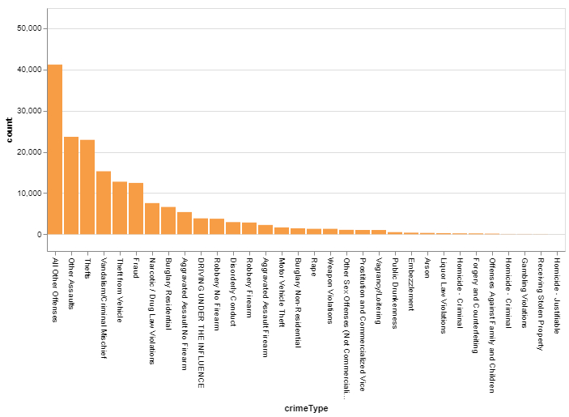

# Urban Outlier


## Team

Member: ZhaoZhen Xu, Xiong Zheng

Tutor: Nick Hand


## Project Description

Streets are the backbone of a city structure. Street qualities (including greening, accesses to transportation, demography, building, and public service etc.. ) will greatly impact the safety and equity of the community living there. The project aims to proactively, using street view analysis, explore the relationships between "street space" and "safety" / "equity". We try to answer following questions in this project.
1. How does the street space quantitatively vary within Philadelphia?
2. Are there clustering for the street quality?
3. What is the relationship between races and their associated living streets? Does it achieve equity and where does the difference exist?
4. What is the relationship between crime occurrence and the quantity of living street components? 
5. For specific crime types, which environment is easier to be effected?


## Method & Results

Compared to the traditional method which will use manually reported or collected datasets (e.g. 311 complaints dataset and house sales dataset). Our method is proactive because we do images analysis on the Street Views provided by the Internet company , whose images are evenly distributed within Philadelphia, preventing the effect of the broken window theory and optionally reported dataset. Broken window theory says people in different classes or communities in different condition will have various tendencies toward reporting and changing the situation.


#### 1. Street Component Analysis

##### 1a. Collection

The Bing Street View is collected by [Bing Developer Api](https://www.microsoft.com/en-us/maps/choose-your-bing-maps-api). This part of codes can be found [here](./data/streetview/streetViewDownloader.ipynb).

```python
def downloadImage(lon,lat):
    point = [f"{lon:.5f}" ,f"{lat:.5f}"]

    # request metadata Api
    url = apiEndpoint.replace("LAT",point[1]).replace("LON",point[0])
    h = requests.get(url)
    responseJson = h.json()
    ...
```

The images were taken by the Bing at 2015, and we wrapped each image every 100m. The location of the collection points and the example of wrapped image are mapped as follows.

<figure><center>
	     
<figcaption>Fig.1 - Street View Collection Points</figcaption>
</center></figure>

<figure><center>

<figcaption>Fig.2 - Sample of the Street View Collection Image</figcaption>
</center></figure>

##### 1b. Component Analysis

An image segmentation method `SegNet` is used to analyzing the elements and their proportion in the images, as described in *SegNet: A Deep Convolutional Encoder-Decoder Architecture for Image Segmentation Vijay Badrinarayanan, Alex Kendall and Roberto Cipolla, PAMI 2017 [http://arxiv.org/abs/1511.00561]* The implication of SegNet in this project is heavliy based on https://github.com/GeorgeSeif/Semantic-Segmentation-Suite.


Here is a sample of the segmentation output.

<figure><center>

<figcaption>Fig.3 - Sample of the Street View Collection Image</figcaption>
</center></figure>

We then count the pixel number of each segment (each color), and calculate the proportion of each segment by dividing the total pixel number.

| pointId | Animal | Archway | Bicyclist | Bridge | Building |    Car | CartLuggagePram |  ... |
| ------: | -----: | ------: | --------: | -----: | -------: | -----: | --------------: | ---: |
|  641548 |  10394 |       4 |        57 |    513 |     3961 | 185859 |            6573 |  ... |
|  640416 |   1313 |       1 |         0 |   2348 |     3583 | 339775 |            6591 |  ... |
|  620130 |   7230 |       1 |        37 |   1012 |      143 | 179598 |            9079 |  ... |
|  401340 |   9336 |       0 |         0 |   1454 |      733 | 204396 |           27068 |  ... |
|  761434 |   6817 |       8 |         9 |     75 |      876 | 127222 |           51155 |  ... |
|     ... |    ... |     ... |       ... |    ... |      ... |    ... |             ... |  ... |

*Table.1 - Counting the pixel number of each segment*

Then, we combined the output components into ten categories (Green, Wall, Lives, Building, Infrastructure, Road, Sidewalk, Sky, Transportation, and Public service), which will make the analysis more concise and intuitive. 

| Categories     | Components                                                                |
| -------------- | ------------------------------------------------------------------------- |
| Wall           | Column_Pole + Fence + Wall + TrafficCone                                  |
| Lives          | Animal + Bicyclist + Child + Pedestrain + MotorcycleScooter + otherMoving |
| Building       | Archway + Building                                                        |
| Infrastructure | Bridge + ParkingBlock + Train + Tunnel                                    |
| Road           | Road + RoadShoulder + LaneMkgsDriv+ LaneMkgsNonDriv                       |
| Sidewalk       | Sidewalk                                                                  |
| Sky            | Sky                                                                       |
| Green          | Tree + VegetationMisc                                                     |
| Transportation | Car + SUVPickupTruck + Truck_Bus                                          |
| PublicService  | CartLuggagePram + SignSymbol + TrafficLight                               |

*Table.2 - Components and Catefories*


##### 1c. Visualization & Result

We plot each category of street view point in the map of Philadelphia, using color to represents the proportion. The purple represents a low proportion and the yellow represents a high proportion. The technical platforms used here are leaflet (to make the map) and the html language (to make the interactive buttons). 

<figure><center>

<figcaption>Fig.4 - Visualization of Component Analysis Image</figcaption>
</center></figure>
From the map, we can learn that for the greening, the street in the north-west and north-east areas have a higher greening proportion. As for the wall, which may represent the defense level of a street, west and mid Philadelphia have higher proportions. For the active lives and buildings on the street, mid and south Philadelphia have higher proportions, which may be the outcome of the high dense population. And the Center City and south Philadelphia, which are main commercial areas of Philadelphia, have more sidewalks and cars on the street; while it is more easy to see the sky in the east-north Philadelphia.


#### 2. Clustering for street quality

##### 1a. Clustering Analysis

Based on the above street component outcome, KMeans Clustering Method is used to find concise descriptions of these components. After attempts, we set the clustering number as four. 

<figure><center>

<figcaption>Fig.5 - Visualization of Clustering map</figcaption>
</center></figure>
Interestingly, even though we did not include the geometry feature when doing the clustering analysis, it still represents spatial clustering feature. This may because of the  administration unit division and community segregation. Adjacent streets will receive similar urban administration and attract similar population.

##### 1b. Visualization & Result

The quantitative diagram for these clustering is as follows. 

<figure><center>

<figcaption>Fig.5 - Visualization of Clustering Diagram</figcaption>
</center></figure>

Based on above quantitative diagram. We attach labels to these four categories, which may describe the feature of these clustering. The labels are as follow.
**`1: High-density`** 

This clustering mainly distributes at the center city which is the most prosperous area in Philadelphia, and it has more buildings, less green, and more openness (less wall and more road) compared to other areas.

**`2: Lush`**

This clustering mainly distributes at the west and mid-north Philadelphia. The features of this clustering are low building density, high street greening, and wide road.

**`3: Spacious`**

This clustering distributes around large natural parks. And besides this, it has relatively less buildings. These two indicated that it is easier to see the sky in the street, which also validated by the analysis. And also this category has more walls, less open to the public compared to other areas.

**`4: Townhouse`**

As this name, townhouse, indicates, the mainly building type within this clustering is townhouse. Therefore, this clustering has more greening, which is mainly made up of private lawns and gardens of townhouses, and less road.


#### 3. Relationship between Street Component & Race

##### 1a. Data Collection

Aside from the component dataset obtained from the above procedure, a dataset of demography is collected. We use the ACS api to collect the demography data of 2015.


#### 4. Relationship between Street Component & Crime

##### 1a. Data Collection

Aside from the component dataset obtained from the above procedure, a dataset of crime incident is also collected. We use the api provided by the OpenDataPhilly to collect the crime incidents from 2015-01-01 to 2016-01-01.


Select crime types: Select by the Top 20 of the aggregated count



Attach nearest street view point attributes to each crime incident: `NearestNeighbors` function, 

Merge the Street view id to the crime data set

Visualization

