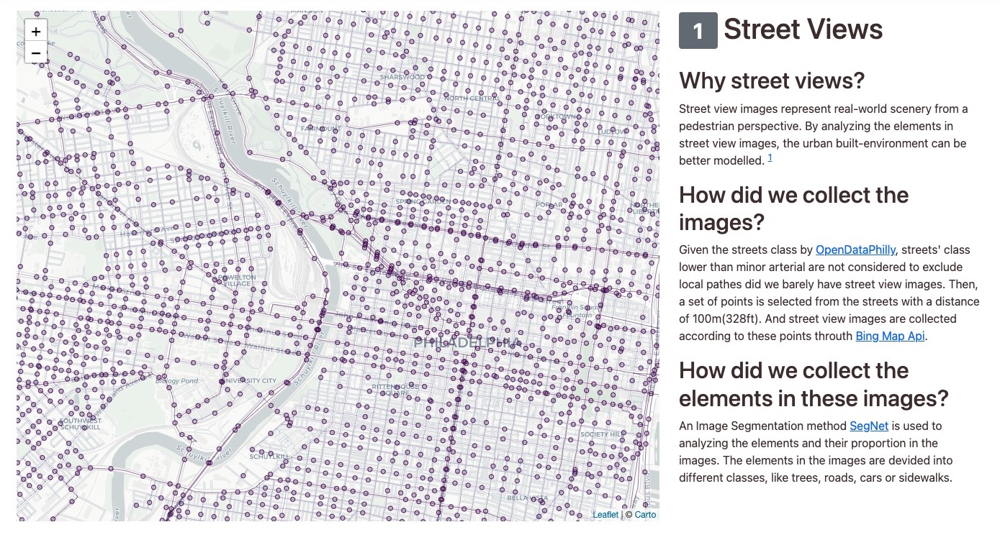
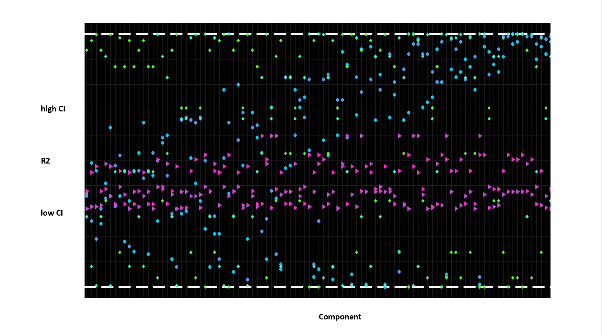

# Proposal


## Datasets to use

The data set(s) you wish to use in the project.

| dataset          | description                                                  | source                 |
| ---------------- | ------------------------------------------------------------ | ---------------------- |
| Bing Street View | 12000+ street view pics for Philadelphia                     | Bing Street View(2015) |
| Street           | Street center line                                           | opendataphilly         |
| ACS 2015         | Race and demography in 2015                                  | census bureau          |
| 311 complaint    | Complaints about street quality in 2015                      | opendataphilly         |
| Crime Incidents  | Crime incidents from the Philadelphia Police Department in 2015 | opendataphilly         |


## Question to explore

#### What is the relationship between "street quality" and "safety and equity"?

1. How do the street qualities vary in streets of Philadelphia?

2. What is the relationship between races and their associated living streets? Whether it has achieved racial equity or not?

3. What is the relationship between crimes and the qualities of living streets? For every specific crime type, Which environment is more prone to this kind of crime? 

   

## Method to utilize

1. Picture analysis to disassemble street quality in Philly, added with exotic 311 complaint dataset to assess the street qualities in Philadelphia

2. Use the above outcome to link with demography data in each census tract unit to see what is the relationship between race and street quality, whether it achieves racial equity

3. Use the above outcome to link with crime incident data around Philadelphia to see what is the relationship between crime and street quality. And for every specific crime type, Which environment is more prone to this kind of crime? how dose the street quality affect our safety


## Outline

1. Introduction about the project and method.

   

2.  Street Component Proportion: point map

   

3. Clustering for the components

   

4. Relationship between street componet and race

   

5. Relationship between street quality and crime. Correlation analysis

   

6. Relationship between street quality and each crime type.

   

## Requirements

How the above items satisfy the requirements outlined in the final project description?

1. ✅ Data is collected through a means more sophisticated than downloading (e.g. scraping, API).

    The Bing StreetView is collected by [Bing Developer Api](https://www.microsoft.com/en-us/maps/choose-your-bing-maps-api). This part of codes can be found [here](./data/streetview/streetViewDownloader.ipynb)

    ```python
    def downloadImage(lon,lat):
        point = [f"{lon:.5f}" ,f"{lat:.5f}"]

        # request metadata Api
        url = apiEndpoint.replace("LAT",point[1]).replace("LON",point[0])
        h = requests.get(url)
        responseJson = h.json()
        ...    
    ```

1. At least one of the datasets contains more than 1 million rows.

1. ✅ It combines data collected from 3 or more different sources.

<<<<<<< HEAD
    We collect data from Census Bureau, OpendataPhilly, and Bing Map.
=======
    `API`, `ACS`, `OpenDataPhilly`
>>>>>>> c68b499de389243dbdf88d9e9ba526a727fc0c09

1. ✅The analysis of the data is reasonably complex, involving multiple steps (geospatial joins/operations, data shaping, data frame operations, etc).

    We applied multiple manipulations to the datasets, including geospatial-joining, aggregation, clastering, correlation analysis.

1. ✅ You use one of the analysis techniques for urban street networks (e.g., osmnx, pandana), clustering (e.g., scikit-learn), or raster datasets.

    We used scikit-learn clustering to identify different types of street view points.

1. You perform a machine learning analysis with scikit-learn as part of the analysis.

1. ✅The webpage includes a significant interactive component (cross-filtering, interactive widgets, etc).

    On the third page of the web, a list of button is created to filter the data.
